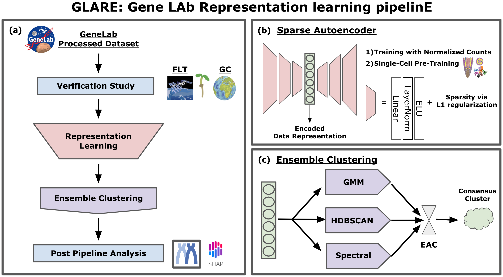

# GLARE: Discovering hidden patterns in spaceflight transcriptome using representation learning

GLARE: GeneLAb Representation learning pipelinE is a new open-source pipeline where researchers can explore GeneLab data using different representation learning models and clustering methods to find hidden patterns in the spaceflight transcriptome data.

## Abstract

Spaceflight studies present novel insights into biological processes through exposure to stressors outside the evolutionary path of terrestrial organisms. Despite limited access to space environments, numerous transcriptomic datasets from spaceflight experiments are now available through NASA’s GeneLab data repository, which allows public access to these datasets, encouraging further analysis. While various computational pipelines and methods have been used to process these transcriptomic datasets, learning-model-driven analyses have yet to be applied to a broad array of such spaceflight-related datasets. In this study, we propose an open-source framework, GLARE: GeneLAb Representation learning pipelinE, which consists of training different representation learning approaches from manifold learning to self-supervised learning that enhances the performance of downstream analytical tasks such as pattern recognition. We illustrate the utility of GLARE by applying it to gene-level transcriptional values from the results of the CARA spaceflight experiment, an Arabidopsis root tip transcriptome dataset that spanned light, dark, and microgravity treatments. We show that GLARE not only substantiated the findings of the original study concerning cell wall remodeling but also revealed additional patterns of gene expression affected by the treatments, including evidence of hypoxia. This work suggests there is great potential to supplement the insights drawn from initial studies on spaceflight omics-level data through further machine-learning-enabled analyses.



## Installation

Our code was tested on `Python 3.9`, to install other requirements:
```setup
pip install -r requirements.txt
```

## Proof of concept

Proof of concept study was presented at ASGSR 2021, where you can find the source code and the abstract poster at [POC_ASGSR2021](POC_ASGSR2021).
