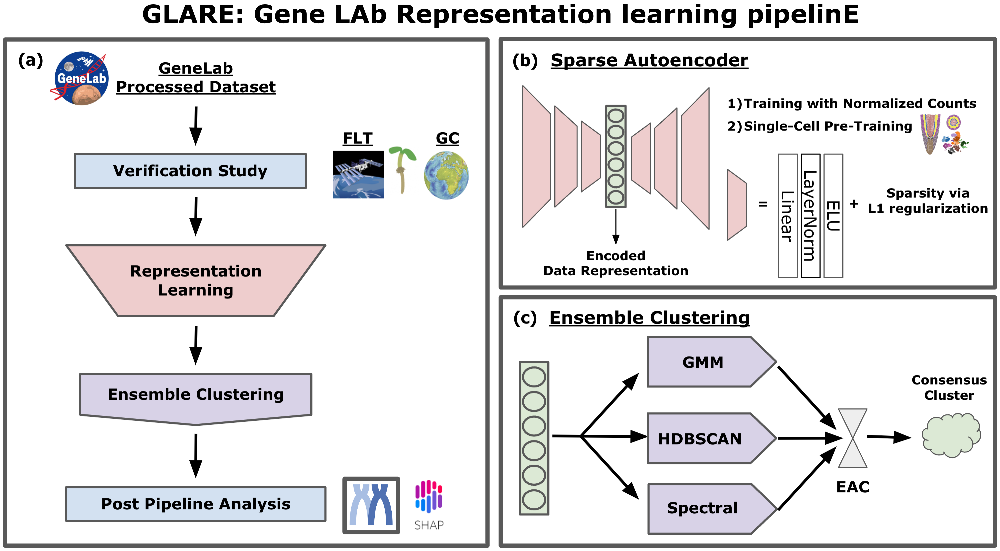

# GLARE: Discovering hidden patterns in spaceflight transcriptome using representation learning

GLARE: GeneLAb Representation learning pipelinE is an open-source machine learning pipeline where researchers can explore GeneLab data using different representation learning models and clustering methods to find hidden patterns in the spaceflight transcriptome data.

## Abstract

Spaceflight studies present novel insights into biological processes through exposure to stressors outside the evolutionary path of terrestrial organisms. Despite limited access to space environments, numerous transcriptomic datasets from spaceflight experiments are now available through NASA’s GeneLab data repository, which allows public access to these datasets, encouraging further analysis. While various computational pipelines and methods have been used to process these transcriptomic datasets, learning-model-driven analyses have yet to be applied to a broad array of such spaceflight-related datasets. In this study, we present an open-source pipeline, GLARE: GeneLAb Representation learning pipelinE, which consists of training different representation learning approaches from manifold learning to self-supervised learning that enhance the performance of downstream analytical tasks. We illustrate the utility of GLARE by applying it to gene-level transcriptional values from the results of the CARA spaceflight experiment, an Arabidopsis root tip transcriptome dataset that spanned light, dark, and microgravity treatments. We show that GLARE not only substantiated the findings of the original study concerning cell wall remodeling but also revealed additional patterns of gene expression affected by the treatments, including evidence of hypoxia. This work suggests there is great potential to supplement the insights drawn from initial studies on spaceflight omics-level data through further machine-learning-enabled analyses. 




## Quickstart

1. Set up your environment. You can either use your base environment or create a conda virtual environment. Assuming anaconda is installed and using Python 3.9+:

```
conda create -n glare_env
conda activate glare_env
```

2. Set working directory:
```
git clone https://github.com/OpenScienceDataRepo/Plants_AWG/tree/main/Manuscript_Code/glare.git
cd glare
```

3. Install requirements:
```setup
conda install pip
pip install -r requirements.txt
```

## Usage

1. Reproducing CARA results:
    1. Download the [CARA dataset (OSD-120)](https://osdr.nasa.gov/bio/repo/data/studies/OSD-120) from the NASA Open Science Data Repository. Find `/GeneLab Processed RNA-Seq Files/Normalized Counts Data/GLDS-120_rna_seq_Normalized_Counts.csv` on the Files section. High-throughput single-cell transcriptome data were used for the pre-training task, where the data can be downloaded [here](https://www.ebi.ac.uk/gxa/sc/experiments/E-CURD-5/downloads) at Normalized counts files folder.

    2. Run the Analysis pipeline. Run `main.py` to perform verification study and restructure the data, pre-train the SAE model with single-cell data, fine-tune the SAE model with CARA data, and to cluster and visualize the final data representations. Run `evaluation.py` to perform a evalution on the final data representations and reproduce the result included in the manuscript. 
    ```
    cd codes
    python main.py
    python evaluation.py
    ```

    3. Based on the evaluation result, pick the best performing data representation and retrieve the clustering result. First, run the SHAP analysis by running `post_pipeline.py`. Next, find hypoxia signaling cluster from the clustering result and run it through the bioinformatics software that were used in the manuscript. Namely, [Morpheus](https://software.broadinstitute.org/morpheus/) for the heatmap of normalized FPKM values, [Metascape](http://metascape.org) for GO terms, and [Stress Knowledge Map](https://skm.nib.si/).
    ```
    python post_pipeline.py
    ```

2. Applying GLARE to new data:
    1. Choose the dataset that you want to study from the [NASA Open Science Data Repository](https://osdr.nasa.gov/bio/repo/search?q=&data_source=cgene,alsda&data_type=study). Find an appropriate dataset, for example a transcriptome data from experiments like the CARA study. Find the related single-cell data that you want to train your model with before fine-tuning with your GeneLab data.

    2. (a) Run the Analysis pipeline. Run `hpt.py` to fine-tune all the hyperparmeters for the model, pre-train the SAE model with single-cell data, fine-tune the SAE model with your GeneLab data, and to cluster and visualize the final data representations. Upon producing multiple data representation for comparison, you can run `evaluation.py` to perform a evalution study.
    ```
    cd codes
    python hpt.py --*Path to your GeneLab Data.csv* --*Path to your single-cell data.mtx*
    ```

    2. (b) See `demo.ipynb` on running GLARE with set hyperparmeters on other GeneLab datsets than CARA dataset (OSD-120). This demo includes GLARE results, including final ensemble clusters, from OSD-217, OSD-406, and OSD-427.

    3. Depending on the type of the dataset, for example having multiple experiments from different gravity setting such as CARA dataset, researchers can also perform verification study and SHAP analysis. Other post pipeline analyses such as Gene Ontology analysis using [Metascape](http://metascape.org) can also be applied to your clutering result.


## Community Support

We encourage users to contribute by:

Reporting issues via the GitHub Issues tab.
Submitting feature requests or suggestions for improvement.
For questions, please contact the authors at [alexdseo@isi.edu].


## Citing GLARE

If you use GLARE in your research, please cite our manuscript:

> **Pre Print**

`
Seo, D., Strickland, H. F., Zhou, M., Barker, R., Ferl, R. J., Paul, A. L., & Gilroy, S. (2024). GLARE: Discovering Hidden Patterns in Spaceflight Transcriptome Using Representation Learning. bioRxiv, 2024-06.
`

```
@article{seo2024glare,
  title={GLARE: Discovering Hidden Patterns in Spaceflight Transcriptome Using Representation Learning},
  author={Seo, DongHyeon and Strickland, Hunter F and Zhou, Mingqi and Barker, Richard and Ferl, Robert J and Paul, Anna-Lisa and Gilroy, Simon},
  journal={bioRxiv},
  pages={2024--06},
  year={2024},
  publisher={Cold Spring Harbor Laboratory}
}
```


## Proof of concept

Proof of concept study was presented at ASGSR 2021, where you can find the source code and the abstract poster at [POC_ASGSR2021](POC_ASGSR2021).
